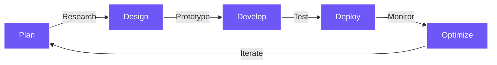

<div align="center">
  
# 👨‍💻 PRASHAN KULATHUNGA

[](https://github.com/prashankulathunga)
[](https://github.com/prashankulathunga)
[](https://github.com/prashankulathunga)


</div>


## 📊 &nbsp;**METRICS**

<div align="center">
   
  
</div>

<div align="center">
  
</div>

## 👾 &nbsp;**ABOUT ME**

```typescript
const prashan = {
  role: "Computer Science Undergraduate @ University of Plymouth",
  focus: ["AI Applications", "Cloud Architecture", "Full Stack Development"],
  currentlyLearning: ["MLOps", "Serverless Architectures", "React Native"],
  skills: {
    languages: ["JavaScript", "Python"],
    frontend: ["React", "TailwindCSS"],
    backend: ["Node.js"],
    devOps: ["Docker"],
    cloud: ["AWS", "GCP"],
  },
  funFact: "I debug with console.logs and refuse to admit it",
};
```

## 🔥 &nbsp;**TECH EXPERTISE**

<div align="center">
  <table>
    <tr>
      <td valign="top" width="50%">
        <h3 align="center">Frontend</h3>
        <div align="center">
          
        </div>
      </td>
      <td valign="top" width="50%">
        <h3 align="center">Backend</h3>
        <div align="center">
          
        </div>
      </td>
    </tr>
    <tr>
      <td valign="top" width="50%">
        <h3 align="center">DevOps & Cloud</h3>
        <div align="center">
          
        </div>
      </td>
      <td valign="top" width="50%">
        <h3 align="center">Tools</h3>
        <div align="center">
          
        </div>
      </td>
    </tr>
  </table>
</div>

## 🚀 &nbsp;**FEATURED PROJECTS**

<div align="center">
  <a href="https://github.com/prashankulathunga/Portfolio">
    
  </a>
  <a href="https://github.com/prashankulathunga/GOLD_PRICE_PREDICT-SYSTEM">
    
  </a>
</div>

## 📈 &nbsp;**ACTIVITY GRAPH**

<div align="center">
  
</div>

## ⚙️ &nbsp;**WORKFLOW**



## 🤝 &nbsp;**CONNECT**

<div align="center">
  <a href="https://www.linkedin.com/in/prashan-kulathunga-673421294/" target="_blank">
    
  </a>&nbsp;
  <a href="mailto:prashan.kulathunga@gmail.com" target="_blank">
    
  </a>&nbsp;
  <a href="https://github.com/prashankulathunga" target="_blank">
    
  </a>
</div>

<div align="center">
  
</div>


<div align="center">
  
</div>
