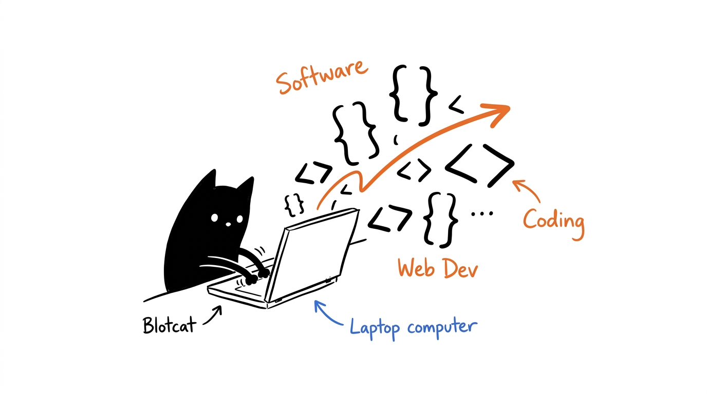

  

  <h3>Software Engineer · ML, Backend</h3>

  

    Production-ready software at the intersection of <strong>machine learning</strong> and
    <strong>backend engineering</strong>.
  

  

    
    
    
    
    
    
    
    
    
    
  

   

    
    
  

